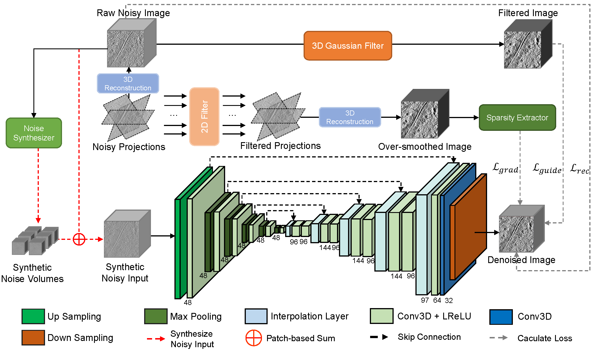

# NMSG
Official implementations and figures of paper "Self-Supervised Noise Modeling and Sparsity Guided Cryo-ET Image Denoising".
<br>
## 1 Introduction

<br>
Figure 1. Overall architecture of NMSG framework. The workflow started with noisy projections which are firstly reconstructed as raw noisy image. Then, noisy projections are filtered and reconstructed as over-smoothed image which is fed into the sparsity extractor to capture the sparsity information. The raw noisy image is filtered with 3D Gaussian filter to generate filtered image as guidance. The synthetic noise volumes are generated from noisy image using noise synthesizer. The synthetic noise volumes are added to raw noisy image to generate synthetic noisy input for the training.
## 2 Operating System
Ubuntu 18.04 or Centos 7 is preferred.
## 3 Requirements
Python >= 3.6.13 <br>
Pytorch >= 1.7.1 <br>
opencv-python 4.5.1 <br>
numpy 1.19.2 <br>
scikit-image 0.17.1 <br>
scikit-learn 0.24.2 <br>
mrcfile 1.3.0 <br>
torchvision >= 0.8.2 <br>
## 4 Test Data
Example real dataset can be found at: <br>
https://drive.google.com
## 5 Usage
#### Training data directory is advised to build as follow
```
DATASET_NAME
-- noisy
-- synthetic_noisy
-- filtered_guidance
-- gradient_guidance
```
## Acknowledgement
We sinceresly thank following work with their open-sourced code. <br>
Bepler, T., Kelley, K., Noble, A.J., Berger, B. Topaz-Denoise: general deep denoising models for cryoEM and cryoET. Nat Commun 11, 5208 (2020).
